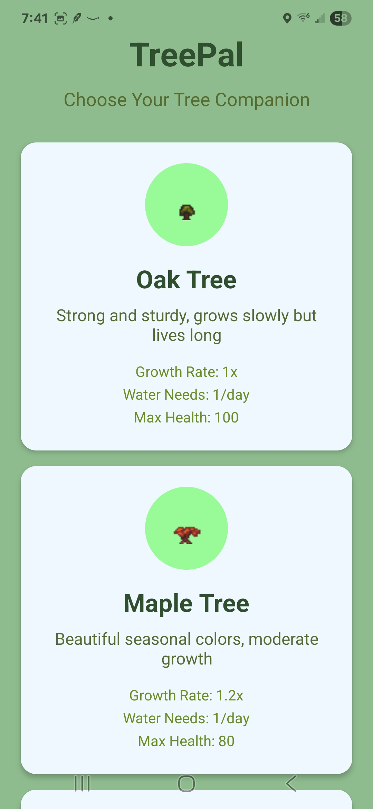
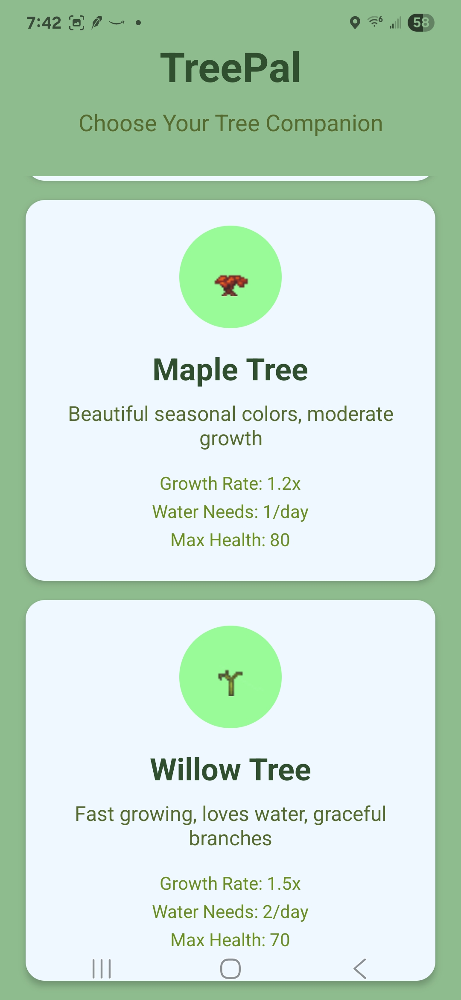
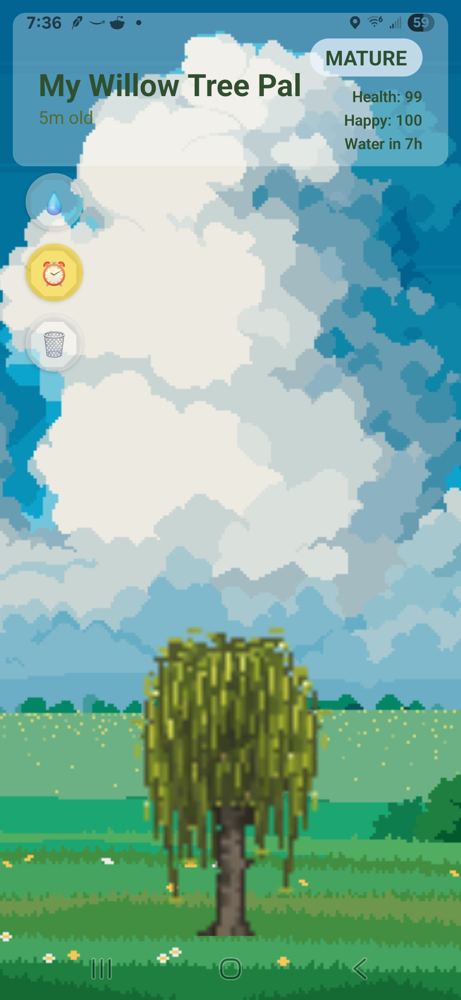

# TreePal

A relaxing virtual tree companion mobile game built with React Native and Expo. Grow and nurture your own pixel art tree from seed to maturity in this peaceful, meditative experience.

## Download

### Android
[Download Latest Release](https://github.com/Bighairymtnman/TreePal/releases/latest)

### Google Play Store
[Get TreePal on Google Play](https://play.google.com/store/apps/details?id=com.mountainmangames.treepal) *(Coming Soon)*

### Beta Testing
Help test TreePal before public release! [Join Beta Test](https://play.google.com/apps/internaltest/4701496029020449373)

## Features

- **Virtual Tree Companion**: Choose from 3 beautiful tree species (Oak, Maple, Willow)
- **Growth Simulation**: Watch your tree grow from seed to mighty tree over time
- **Interactive Care**: Water your tree to keep it healthy and thriving
- **Relaxing Audio**: Soothing nature sounds and tranquil background music
- **Pixel Art Graphics**: Beautiful hand-crafted pixel art visuals
- **Peaceful Gameplay**: No timers, no pressure - just pure relaxation

## Installation Instructions

### Android
1. Download the APK file from the latest release
2. On your Android device, go to Settings > Security
3. Enable "Install from Unknown Sources" or "Allow from this source"
4. Open the downloaded APK file
5. Follow the installation prompts
6. The app will appear on your home screen

## Screenshots

## System Requirements

- **Android**: Version 6.0 (API level 23) or higher
- **Storage**: 25MB available space
- **RAM**: 1GB minimum recommended

## Credits

- **Audio**: Nancy_Sinclair via Freesound.org
- **Tree Pixel Art**: Blacis via itch.io
- **Background Art**: CraftPix via OpenGameArt.org (OGA-BY 3.0)

## Privacy

- No personal information is collected or transmitted
- No internet connection required after installation
- Completely offline experience

## Support

If you encounter any issues or have questions, please create an issue in this repository.

## Version History

### v1.0.0
- Initial release
- 3 tree species available
- Core growth and watering mechanics
- Relaxing audio and pixel art graphics

---

**TreePal** - *Grow your virtual companion* 🌱

Made MountainMan Games

Copyright 2025. All rights reserved.
This software is provided for personal use only.
