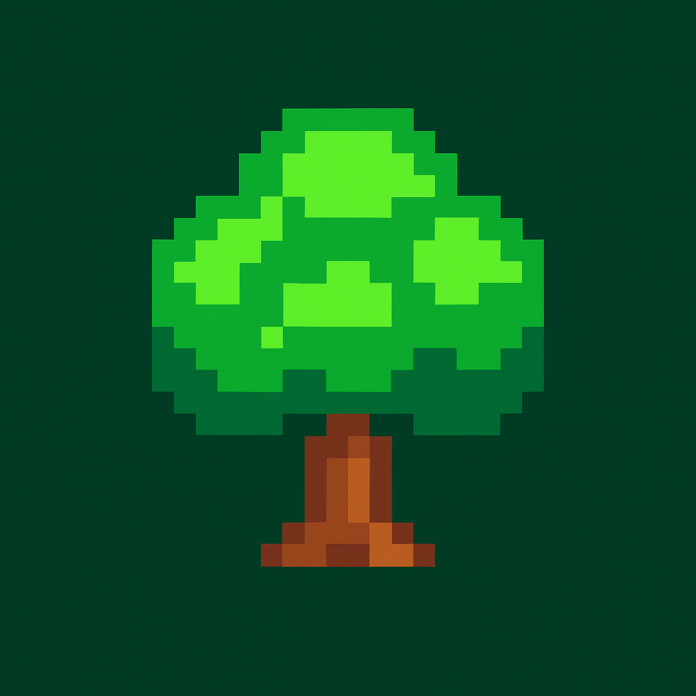
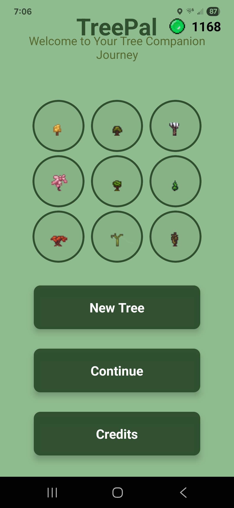
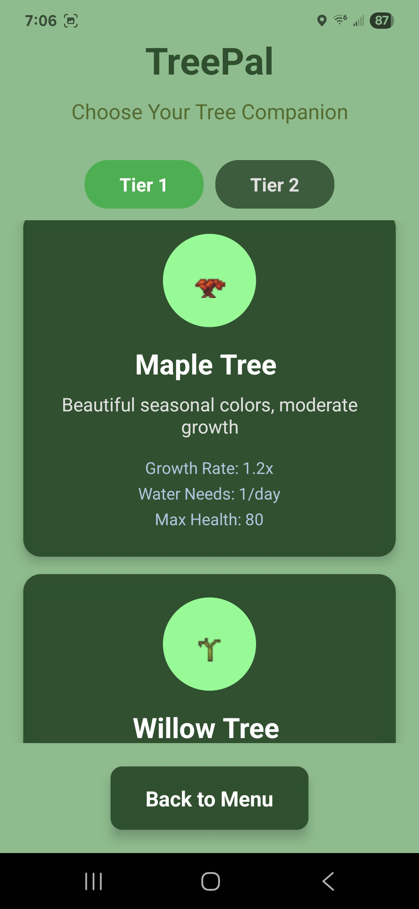
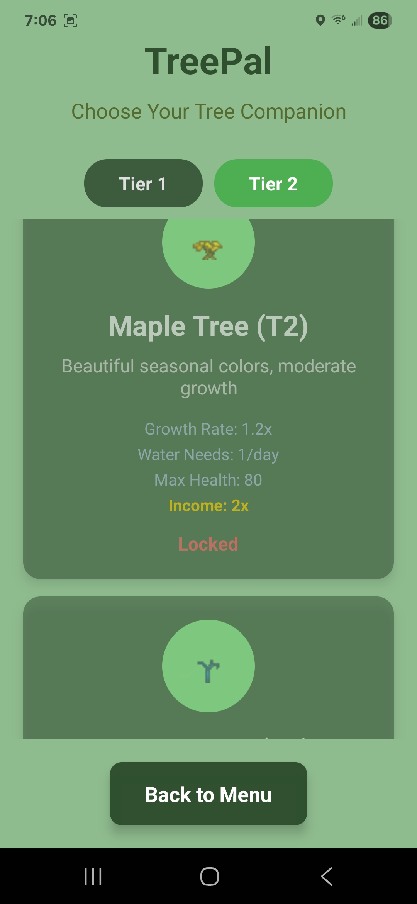
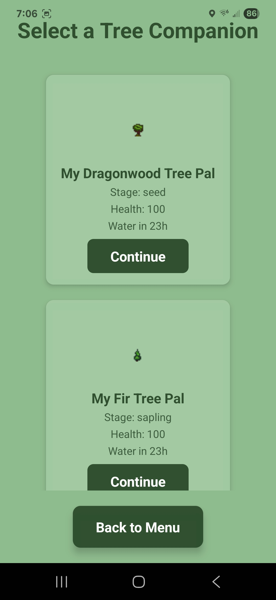
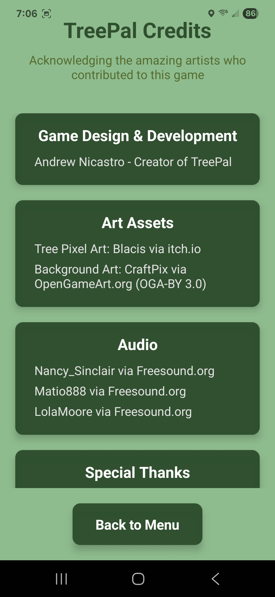
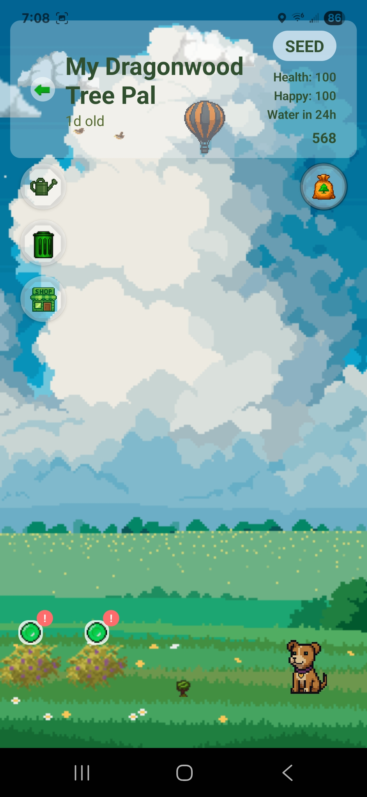
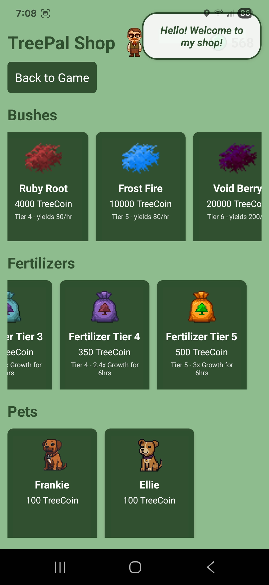
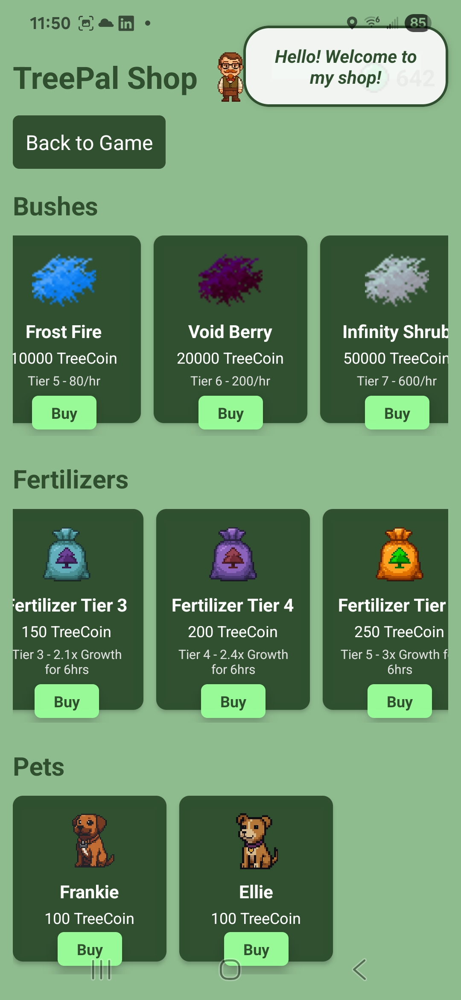

# TreePal

A relaxing virtual tree companion mobile game built with React Native and Expo. Grow and nurture your own pixel art tree from seed to maturity in this peaceful, meditative experience.

## Download

### Google Play Store
[Get TreePal on Google Play](https://play.google.com/store/apps/details?id=com.yourname.treepal) 

## Features

- **Virtual Tree Companion**: Choose from 10 tree species
- **Growth Simulation**: Watch your tree grow from seed to mighty tree over time
- **Interactive Care**: Water your tree to keep it healthy and thriving
- **Relaxing Audio**: Soothing nature sounds and tranquil background music
- **Pixel Art Graphics**: Beautiful hand-crafted pixel art visuals
- **Peaceful Gameplay**: No pressure - just pure relaxation

## Installation Instructions

### Android
1. Download the APK file from the latest release
2. On your Android device, go to Settings > Security
3. Enable "Install from Unknown Sources" or "Allow from this source"
4. Open the downloaded APK file
5. Follow the installation prompts
6. The app will appear on your home screen

## Screenshots

## System Requirements

- **Android**: Version 6.0 (API level 23) or higher
- **Storage**: 180MB available space
- **RAM**: 1GB minimum recommended

## Credits

- **Audio**: Nancy_Sinclair via Freesound.org, Matio888 via Freesound.org, LolaMoore via Freesound.org
- **Tree Pixel Art**: Blacis via itch.io
- **Background Art**: CraftPix via OpenGameArt.org (OGA-BY 3.0)

## Privacy

- No personal information is collected or transmitted
- No internet connection required after installation
- Completely offline experience

## Support

If you encounter any issues or have questions, please create an issue in this repository.

## Version History

### v1.0.0
- Initial release
- 3 tree species available
- Core growth and watering mechanics 
- Relaxing audio and pixel art graphics

### v2.0.2
New features:
- 7 new tree types!
- 3 save slots (grow multiple trees!)
- New main menu
- Credits screen
- Minor bug fixes

## Future Updates

TreePal is actively being developed! Planned features include:

### More Tree Species
- Currently: Maple, Oak, Willow
- Coming: Cherry Blossom, Birch, Redwood, Palm, and more!

### Enhanced Audio
- Additional relaxing background tracks
- Seasonal nature sounds
- Tree-specific audio themes

### Weather System
- Dynamic weather effects
- Rain, snow, sunshine animations
- Weather impacts on tree growth

### Additional Features
- Tree customization options
- Growth milestones and achievements
- Multiple tree gardens
- Day/night cycle

*Follow this repository for updates!*

---

**TreePal** - *Grow your virtual companion* 🌱

Made by MountainMan Games

Copyright 2025. All rights reserved.
This software is provided for personal use only.
